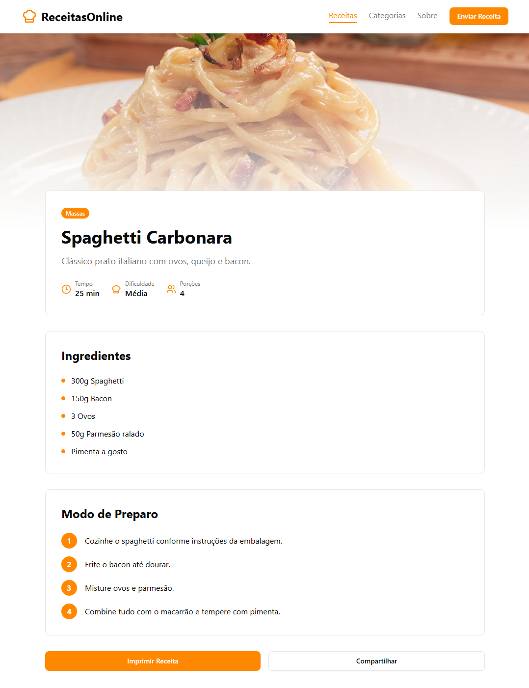
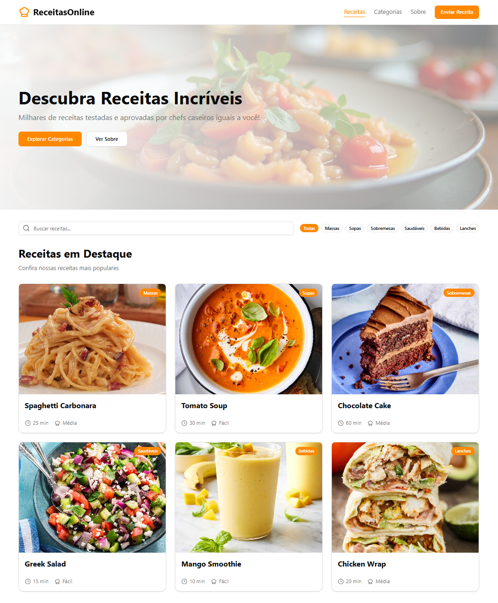
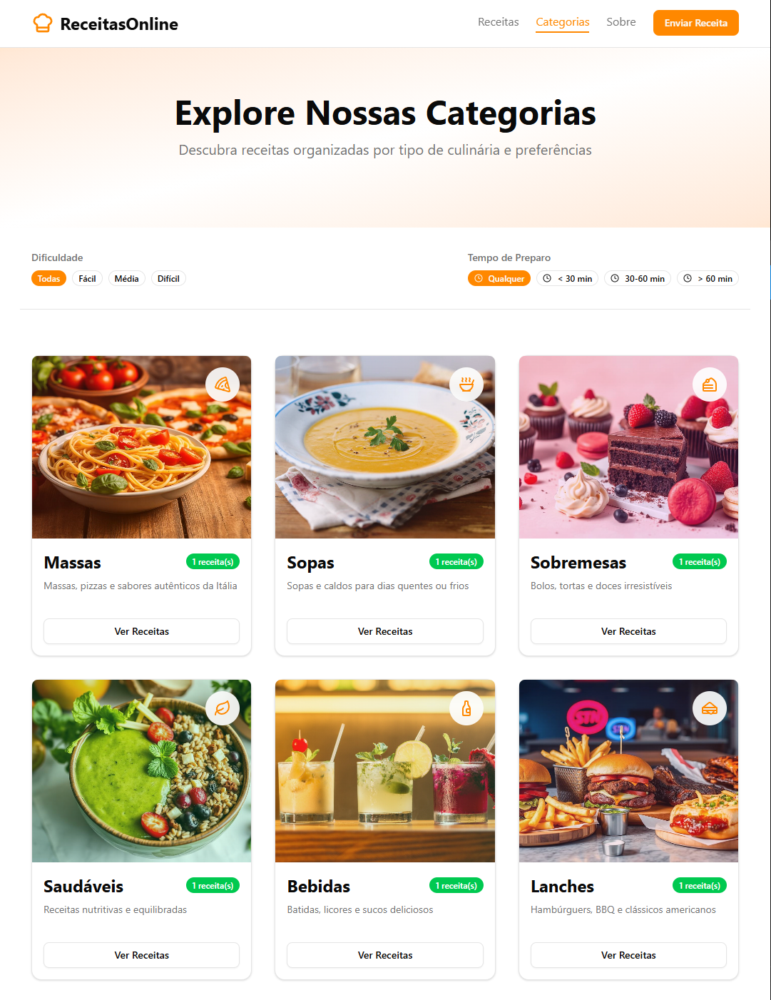
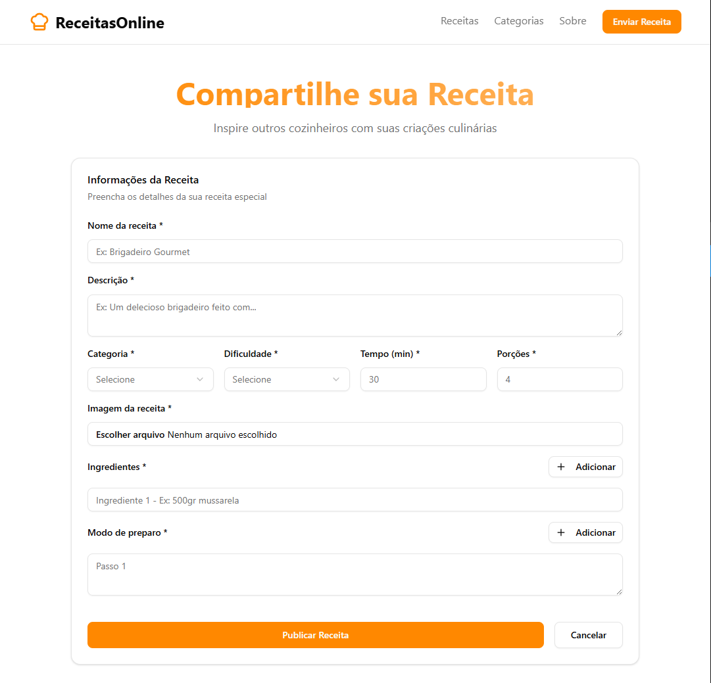

<div align="center">

# 🍕 Receitas Online

### Uma plataforma moderna para cadastrar, listar e visualizar receitas com praticidade.

</div>

## 👀 Prévia do site

<div style="display: grid; grid-template-columns: repeat(auto-fit, minmax(320px, 1fr)); gap: 12px;">
    
    
    
    
</div>

## 🔎 Sobre o projeto

O **Receitas Online** é um site desenvolvido para facilitar o armazenamento e organização de receitas de forma online. Ele oferece uma interface intuitiva para criar e visualizar receitas com imagem, categorias, dificuldade e tempo de preparo.

Este projeto foi construído com foco em **boas práticas**, **componentização** e uso de tecnologias modernas do ecossistema React, como React Query, Zod e Shadcn UI.

## 🚀 Tecnologias utilizadas

- **React + TypeScript**
- **Vite**
- **Tailwind CSS**
- **Shadcn UI**
- **Axios**
- **@tanstack/react-query**
- **@tanstack/form**
- **Zod**
- **React Router**
- **Lucide Icons**

## 🧩 Funcionalidades

- **Criação de Receitas:** Usuários podem adicionar novas receitas com detalhes como ingredientes, passo a passo, tempo de preparo e uma imagem da receita pronta.
- **Autenticação de Usuários:** Para adicionar uma nova receita é necessário estar registrado no sistema, identificando assim o autor de cada nova receita.
- **Pesquisa e Filtragem:** Funcionalidade robusta para encontrar receitas rapidamente por nome, dificuldade, categoria ou tempo de preparo.
- **Validação de Dados:** Utilização do Zod e @tanstack/form para garantir que todos os dados inseridos nas receitas são válidos e completos.
- **Experiência Otimizada:** Aproveitamento do @tanstack/react-query para caching inteligente, reduzindo o número de requisições e melhorando a velocidade de navegação.
- **Layout Responsivo:** Experiência otimizada para visualização em desktops, tablets e smartphones.

## 📦 Estrutura de pastas principais

```
└───src
    │───assets
    │───components
    │    │──layout
    |    └──ui
    │───context
    │───hooks
    │───lib
    │───pages
    │───routes
    │───schemas
    │───services
    └───utils
```

## ⚙️ Como rodar o projeto localmente

### 1. Clone o repositório

```bash
git clone https://github.com/luismarcato/online-recipes-web.git
```

### 2. Acesse a pasta

```bash
cd online-recipes-web
```

### 3. Instale as dependências

```bash
npm install
```

### 4. Crie o arquivo `.env`

```ini
VITE_API_URL=http://localhost:3000
```

### 5. Execute o servidor de desenvolvimento

```bash
VITE_API_URL=http://localhost:3000
```

## 📜 Licença

Projeto licenciado sob a licença MIT — fique à vontade para usar e modificar.

## ❄️ Considerações Finais

> Este projeto foi criado para compor meu portfólio e demostrar conhecimentos nas principais tecnologias utilizadas junto com React, arquitetura frontend moderna e boas práticas de desenvolvimento.

Sugestões e feedbacks são sempre bem-vindos! ♥️

